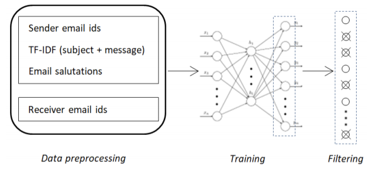
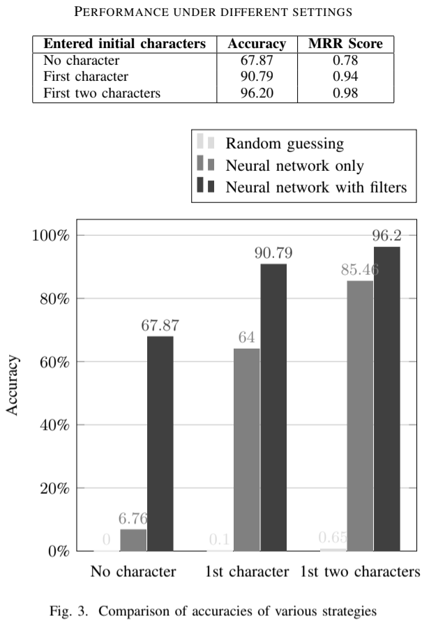

# Email recipients prediction using neural networks

- Table of contents
  * [Overview](#overview)
  * [How to run?](#how-to-run-)
  * [Files description:](#files-description-)
  * [Approach](#approach)
  * [Experiments and results](#experiments-and-results)
  * [Conclusion](#conclusion)

## Overview
Smart email clients can now smartly provide a list of recipients to choose from on the basis of initial characters. But it may cause the problem of email delivery to a wrong person due to the wrong selection of recipient from the provided list. Since sending information over email can sometimes be critical and, generally, it is not possible to undo the action, it is very important to ensure the selection of correct recipient’s email id while sending an email. This work proposes an algorithm that predicts the most probable recipient for an email and generates a warning in case of potentially wrong recipient selection using neural network along with some filtering techniques. Experimental results prove that the  algorithm is efficient and accurate.

## How to run?
1. Download training dataset at https://drive.google.com/file/d/1efpbJLL6JFmgbtKaYAXCdKpHxKxNQ-x0/view?usp=sharing
2. Download testing dataset at https://drive.google.com/file/d/1GzZkct6ZZFC5VllKi0J5AAADtrm4NqL6/view?usp=sharing
3. Run training.py to train the model.
4. Run testing.py to test the model. 
5. Run predict_recipient.py to predict the recipient for user input  data.

## Files description:
- generate_vocabs.py  : to generate dictionaries for sender email ids, receiver email ids and word vocabulary.
- generate_training_dataset.py : to prepare lists of inputs and outputs for training.
- sal_parser.py : to extract salutations from emails.
generate_testing_dataset.py : to prepare lists of inputs and outputs for testing.
- training_data.csv : training data of 439790 samples in the following format: <sender_email_id, receiver_email_id, subject, message> 
- testing_data.csv : testing data of 77611 samples in the following format: <sender_email_id, receiver_email_id, subject, message>

    Notes
    1.	During testing, the user will be prompted to use salutation filters or not for predicting outputs. This has been kept optional since salutation filters may or may not work depending on the emails in the dataset.
    2.	All the trailing past threads in an email message have been trimmed off to train only on the message being sent.

## Approach
This project presents an approach to predict the recipient email id based on the past email interactions between different users using artificial neural network. The  approach would work well with any appropriately-sized email dataset. Due to the limited availability of the email data sets, all the experiments in this model have been performed using the Enron data set which is publicly available. The  algorithm takes the sender email id and the composed message as input and generates the probable recipient email id as the output. There are two stages in this algorithm. Firstly, the processed messages (TFIDFs) are input to the neural network to produce a ranked list of all the possible recipient email ids. Then, we apply some filtering techniques to refine the predictions. The model initially predicts the recipient email id without the use of any initial characters of the recipient email id. Then, it further refines the results using the initial characters of the recipient email id if the user enters one or more initial characters. The results are repeatedly filtered leading to higher accuracy with each entered character. If the user enters an email id which is less likely to be the correct recipient, a warning will be generated regarding the same. This means that along with recommending the possible recipient, this system could also prevent the message from being sent to any wrong person. The block diagram of the  methodology has been shown in figure below. As depicted in the figure, it consists of three stages: data preprocessing, neural network training and filtering its output to predict the correct recipient email id.

## Experiments and results
All the evaluations were performed using the Enron data set. The neural network was trained on 439,790 emails of this data set. The Enron data set contains a lot of emails which are addressed to more than one recipient. For efficient training of the neural network, only the first recipients from each such sample were considered. In the training data, 77,178 different email ids were encountered. Out of this, 19,174 email ids appeared at least once as a sender and 66,386 email ids appeared at least once as a recipient. So, here the task of the neural network was to rank these 66,386 recipient email ids for a given input email. As stated earlier, the remaining email ids which had never appeared as recipients in the data set were not considered in the output classes. This is because a neural network learns from the past data, thus, cannot be expected to correctly predict a recipient which has never been addressed in the past, i.e., the training data set. Similarly, any new sender which had never been encountered as a sender in the training data set were also been discarded while calculating the efficiency of the model.

## Conclusion
The email system has revolutionized the way organizational-level communications occur today. Yet, utmost measures need to be taken when dealing with important messages. When handling large numbers of emails on a daily basis, users some- times send emails to wrong recipients in haste. The  model intelligently predicts the most probable recipient for the given email and generates a warning if the user tries to send it to a less probable recipient. This substantially prevents such undesired events preventing communication confusions or threats to confidentiality. No work done in the past has been able to achieve the efficiency as high as the model  in this project in terms of accuracy and the capability to predict correct recipient email id among a high number of email ids. Using TF-IDF vectors of the messages and artificial neural networks, this model predicts the correct recipients with high accuracy when combined with the filtering techniques as  in this project. This model can be easily integrated into any organization’s email editor to actualize this email prediction system in real time.

